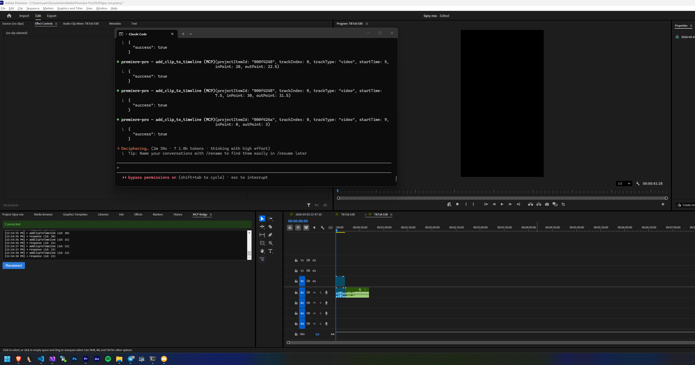

# Premiere Pro MCP Server

Control Adobe Premiere Pro from Claude using the [Model Context Protocol](https://modelcontextprotocol.io). 170+ tools for editing, effects, captions, export, and more.



## How it works

```
Claude ←→ MCP Server (Node.js) ←→ WebSocket ←→ CEP Panel ←→ ExtendScript ←→ Premiere Pro
```


## Requirements

- **Adobe Premiere Pro 2023+** (tested on 2026)
- **Node.js 18+**
- **Claude Desktop** or **Claude Code**
- **Windows**

## Quick Start

### Automatic Install

```bash
git clone https://github.com/antipaster/premiere-pro-mcp.git
cd premiere-pro-mcp
install.bat
```

The installer will:
1. Enable unsigned CEP extensions (debug mode)
2. Symlink the CEP panel into Premiere Pro's extensions folder
3. Install dependencies and build
4. Configure Claude Desktop and Claude Code

### Connect

1. Open Premiere Pro
2. Go to **Window > Extensions > MCP Bridge**
3. The panel should show **"Connected"**
4. Start Claude and use Premiere Pro tools

## Configuration

Copy `config.example.json` to `config.json` and edit:

```json
{
  "port": 8097,
  "elevenlabs": {
    "api_key": "your-elevenlabs-api-key",
    "default_voice_id": "21m00Tcm4TlvDq8ikWAM",
    "default_model": "eleven_multilingual_v2"
  }
}
```

| Setting | Description | Default |
|---------|-------------|---------|
| `port` | WebSocket port for CEP bridge | `8097` |
| `elevenlabs.api_key` | ElevenLabs API key for AI voiceover | `""` |
| `elevenlabs.default_voice_id` | Default voice (Rachel) | `21m00Tcm4TlvDq8ikWAM` |
| `elevenlabs.default_model` | TTS model | `eleven_multilingual_v2` |


## Tools (170+)

### Project (28 tools)
`open_project` `save_project` `close_project` `import_media` `create_bin` `find_project_items` `get_project_info` `get_project_items` `create_proxy` `attach_proxy` `toggle_proxy_mode` `create_sub_clip` `relink_media` `refresh_media` `import_ae_comps` `import_sequences` `flush_cache` `delete_project_items` `consolidate_duplicates` `set_project_settings` `set_project_item_in_out` `clear_project_item_in_out` `rename_project_item` `get_project_item_info` `get_project_item_type_info` `set_override_frame_rate` `set_override_pixel_aspect_ratio` `move_project_item`

### Sequence (23 tools)
`create_sequence` `create_sequence_from_clip` `clone_sequence` `delete_sequence` `set_active_sequence` `get_active_sequence` `get_sequences` `get_sequence_settings` `add_tracks` `remove_track` `rename_track` `get_track_info` `set_track_locked` `set_track_muted` `create_subsequence` `nest_clips` `auto_reframe_sequence` `scene_edit_detection` `set_sequence_in_out` `clear_sequence_in_out` `get_work_area` `set_work_area` `deselect_all`

### Timeline (25 tools)
`add_clip_to_timeline` `overwrite_clip_to_timeline` `remove_clip` `move_clip_to_track` `set_clip_position` `set_clip_in_out` `set_clip_speed` `razor_clip` `razor_all_tracks` `ripple_delete` `enable_disable_clip` `set_timeline_clip_label` `rename_clip` `link_clips` `unlink_clip` `duplicate_clip` `freeze_frame` `slip_clip` `slide_clip` `set_clip_mute` `get_clip_info` `get_clip_speed` `get_selection` `select_clips` `set_scale_to_frame_size`

### Effects (19 tools)
`apply_effect` `remove_effect` `get_clip_effects` `set_effect_enabled` `get_effect_property` `set_effect_property` `get_video_effects_list` `get_audio_effects_list` `apply_transition` `remove_transition` `get_video_transitions_list` `get_audio_transitions_list` `set_default_transition` `add_keyframe` `remove_keyframe` `get_keyframes` `set_keyframe_interpolation` `get_clip_transform` `set_clip_transform`

### Markers (8 tools)
`add_marker` `get_markers` `remove_marker` `clear_all_markers` `update_marker` `add_clip_marker` `get_clip_markers` `add_project_item_marker`

### Audio (10 tools)
`set_clip_volume` `get_clip_volume` `set_track_volume` `set_track_pan` `solo_track` `get_audio_channel_mapping` `set_audio_channel_mapping` `apply_audio_crossfade` `add_audio_keyframe` `set_clip_mute`

### Export (9 tools)
`export_sequence` `export_direct` `export_frame` `export_aaf` `export_omf` `export_edl` `export_final_cut_xml` `export_captions` `get_encoder_presets`

### Graphics & Captions (18 tools)
`add_text_graphic` `add_tiktok_caption` `add_caption_sequence` `style_text_graphic` `get_available_mogrts` `import_mogrt` `add_mogrt_to_timeline` `get_mogrt_properties` `set_mogrt_property` `add_color_matte` `add_black_video` `add_bars_and_tone` `add_caption_track` `get_caption_tracks` `get_captions` `add_caption` `update_caption` `remove_caption`

### AI (3 tools)
`elevenlabs_list_voices` `elevenlabs_generate_speech` `elevenlabs_generate_captions_voice`

### Playback & Scripting (22 tools)
`play` `stop` `step_forward` `step_backward` `go_to_start` `go_to_end` `go_to_next_edit` `go_to_previous_edit` `go_to_in_point` `go_to_out_point` `set_playhead` `get_playhead` `set_workspace` `open_in_source_monitor` `get_source_monitor_clip` `set_source_in_out` `execute_extendscript` `execute_qe_script` `get_app_version` `undo` `redo` `get_connection_status`

### Metadata (10 tools)
`get_clip_metadata` `set_clip_metadata` `get_file_metadata` `get_xmp_metadata` `set_xmp_metadata` `get_clip_color_space` `set_clip_description` `set_project_item_label` `set_label_defaults` `set_scale_to_frame_size`

## Architecture

```
premiere-pro-mcp/
├── src/                    # MCP server (TypeScript)
│   ├── server.ts           # Entry point
│   ├── bridge.ts           # WebSocket bridge to CEP
│   ├── config.ts           # Config loader
│   └── tools/              # 14 tool modules
│       ├── index.ts
│       ├── project.ts      # Project management
│       ├── sequence.ts     # Sequence operations
│       ├── timeline.ts     # Timeline editing
│       ├── effects.ts      # Effects & transitions
│       ├── markers.ts      # Markers
│       ├── audio.ts        # Audio controls
│       ├── export.ts       # Export & render
│       ├── metadata.ts     # Metadata & XMP
│       ├── captions.ts     # Captions & subtitles
│       ├── graphics.ts     # Graphics, MOGRTs, text
│       ├── playback.ts     # Playback & navigation
│       ├── scripting.ts    # Raw ExtendScript & QE
│       ├── ai.ts           # ElevenLabs TTS
│       └── connection.ts   # Connection status
├── cep/                    # CEP extension (runs inside Premiere)
│   ├── CSXS/manifest.xml   # Extension manifest
│   ├── index.html          # Panel UI
│   ├── js/
│   │   ├── CSInterface.js  # Adobe CSInterface v11
│   │   └── main.js         # WebSocket client + JSX loader
│   └── jsx/                # ExtendScript modules
│       ├── premiere.jsx    # Entry point
│       ├── utils.jsx       # Shared helpers
│       ├── project.jsx     # Project functions
│       ├── sequence.jsx    # Sequence functions
│       ├── timeline.jsx    # Timeline functions
│       ├── effects.jsx     # Effects functions
│       ├── markers.jsx     # Marker functions
│       ├── audio.jsx       # Audio functions
│       ├── export.jsx      # Export functions
│       ├── metadata.jsx    # Metadata functions
│       ├── captions.jsx    # Caption functions
│       ├── graphics.jsx    # Graphics functions
│       └── playback.jsx    # Playback functions
├── config.json             # Configuration
├── install.bat             # Auto-installer
├── package.json
└── tsconfig.json
```


## License

MIT
